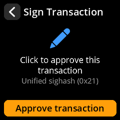
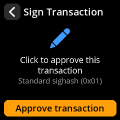
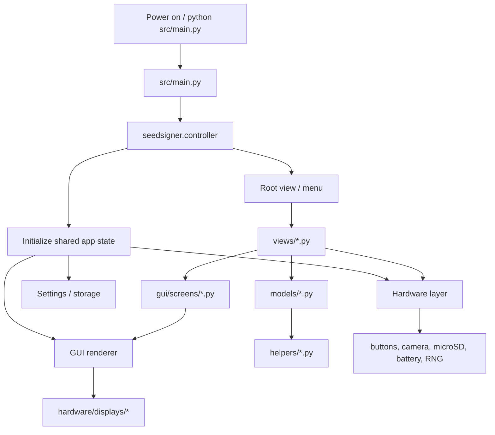
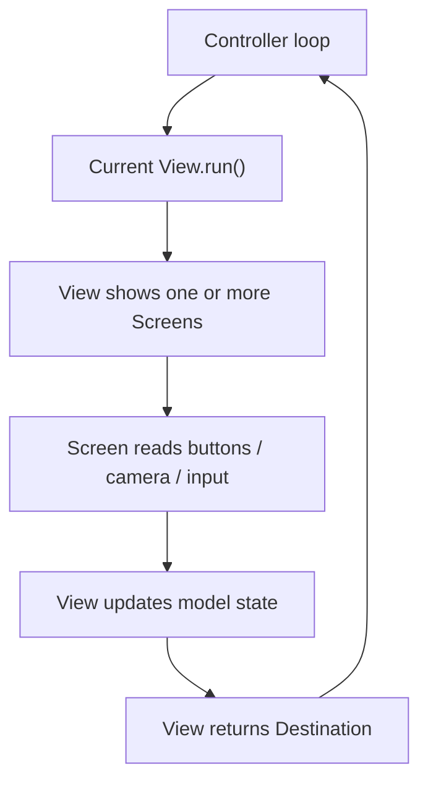
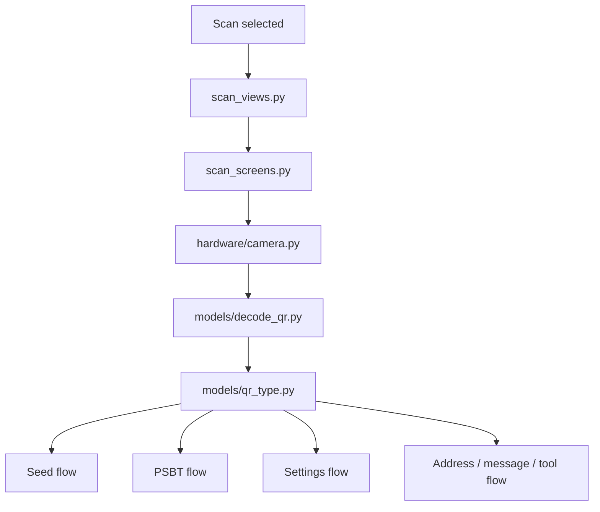
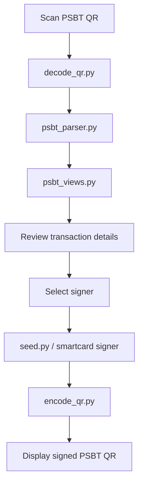
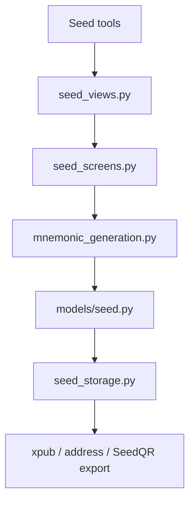
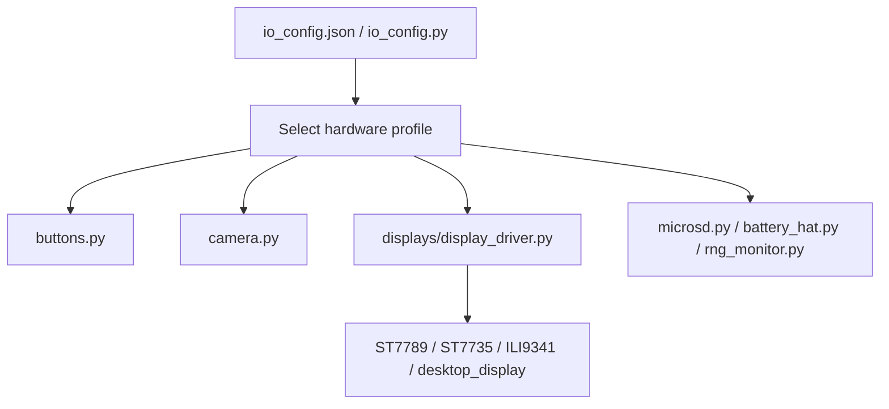

# SeedSigner + Satochip, with the unified opt-in signature hash

The [smartcard fork](https://github.com/3rdIteration/seedsigner) of SeedSigner, signing with the unified opt-in signature hash defined by the Bitcoin hardfork, as Bitcoin Knots `v29.4.1.knots20260508` specifies it in [doc/unified-sighash.md](https://github.com/bitcoinknots/bitcoin/blob/v29.4.1.knots20260508/doc/unified-sighash.md). Unofficial, and affiliated with neither project.

> **Not audited, and not run on smartcard hardware.** The card path is covered against a simulated card, ending at a Bitcoin Knots regtest node that accepts and mines the result; no signature from a real Satochip or Keycard has been checked. Use at your own risk, and no warranty of any kind, see the [MIT license](LICENSE.md). Everything below the divider is the fork's own documentation.

## What this branch adds

- **Signs the unified message when the transaction asks for it**, from a seed and from a card alike. A PSBT declaring hash type `0x21` is signed with the hardfork's message; one declaring nothing is signed the standard way, exactly as before.
- **The signature hash type is on the approval screen.** `Unified sighash (0x21)` or `Standard sighash (0x01)`, so a host that quietly rewrites the request cannot do it without you seeing. For seed signing, what the screen names is checked against every signature the device makes before anything leaves it.

   

- **A transaction it can only sign part of is refused**, rather than signed in part and reported as complete.
- **[embit](https://github.com/privkeyio/embit) is pinned to a fork** carrying the algorithm, by commit, because the stock library signs the standard way and reports nothing unusual while doing it.

A Satochip or Keycard is handed 32 bytes and signs them blind, so nothing on the card decides which message it just committed to. The type is chosen on the SeedSigner, used to build the digest, and appended to the signature there. That is what makes the opt-in reachable from a card at all, and it is why the approval screen is the thing to read.

This carries no activation height and decides no consensus rules. It is the signature message only: the wallet that builds the PSBT decides which one to ask for.

---------------

# SeedSigner + Satochip
The question of how to store your private keys in a way that is both secure and resistant to loss or damage is a challenge.

There are a number of different approaches that different hardware and software wallets use and one that has been gaining popularity, particularly with stateless wallets, is SeedQR… The thing is that while SeedQR is much quicker and easier than a standard seed phrase, storing and loading private keys via SeedQR all the time has it’s own issues relating to security, robustness and privacy… 

That said, I think that saving secrets to a PIN protected Javacard addresses all of these issues in a really affordable and accessible way… I have been doing to integrate the Seedkeeper from Satochip with Seedsigner… Basically as a proof of concept… This is now at a point where it can be considered Beta software, in that it is mostly feature complete. (Though will still likely have other bugs and tweaks to come) [You can read more about the rationale, software and hardware being used here](./docs/smartcard_support_installation.md)

All releases are now running SeedSigner-OS and are built via BuildRoot just like official builds, meaning that the MicroSD card can be removed for normal operation. (Though the MicroSD needs to be left in while building and flashing Java applets or flashing SeedSigner images to MicroSD) This also means that installation images are much smaller and are also reproducible. 

[I have a video on my YouTube channel which covers the functionality below and also talks about the physical build side.](https://youtu.be/Rhs9z5uL7qg)

Support and discussion relating to this fork can happen via this [Telegram Group](https://t.me/+mp3CIjCQuk0yMjUx)

## Difference from Stock SeedSigner
* Multiple Smartcard interface options… 
   - Smartcard Hat (SEC1210 Connected via UART)
   - Standard USB CCID/PCSC readers
   - PN532 NFC Reader Connected via I2C
   - USB Phoenix Type "Sim Reader" supported via OpenCT 
* Saving and Loading Seeds & Passphrases in a number of ways
   - Seedkeeper: Supports loading of Seed, Seed+Passphrase in one go, or loading passphrase independently. (Potentially from a different SeedKeeper)
   - Encrypted QR: Supports Krux compatible encrypted seeds
   - Passphrase QR: Supports loading a passphrase from a plain text QR code
   - Plaintext QR: Support Exporting Seed as Plaintext QR Code
   - Split passphrase/encryption key QR support (Multi-Factor entry)
* Saving and Loading Multisig Descriptors to Satochip Seedkeeper Cards 
   - Also changed default behavior to keep Descriptor loaded until manually cleared. (Including descriptor appearing in the Address Explorer when loaded)
   - Descriptors are split up into a template and xpubs before being saved to SeedKeeper.
   - Includes ability to load single-sig descriptor and use Address Browser
* Saving and loading generic secrets to a Seedkeeper card
   - These secrets can be either viewed as text or displayed as a generic text QR code.
* General Satochip/Seedkeeper card operations
  - Initialise Card
  - Change Card PIN
  - Change Card Label
  - Set NFC Policy
  - Factory Reset Card
  - Smartcard info screen with card UID
  - Genuineness check
* Satochip Card features
  - Load any Seed from the SeedSigner on to the Satochip Card
  - Enable 2FA on the Satochip Card
  - Export xpubs (single- and multisig) 
  - PSBT verification and transaction signing directly on-card
  - Message signing
  - Address explorer integration for Satochip cards
  - Backend selection note: entering via the KeyCard menu now forces the keycard backend (no auto-detection in that flow). Auto fallback logic is only used in generic/satochip flows where backend is not explicitly set.
* SLIP39 seed support
  - Create, import and extend SLIP39 seed shares (Can load from text, QR or Seedkeeper)
  - Save SLIP39 shares to Seedkeeper
  - Initialise Satochip card from reconstructed SLIP39 seed.
  - Settings to toggle SLIP39 functionality
* BIP85 Support
   - Supports not only generating BIP85 seeds, but loading them and using them
* WIF/BIP38 key signing support (disabled by default)
* Wallet xpub export verification (Checks receive address for safety)
* TextQR Tool
   - Supports both generating and loading standard plaintext QR codes for arbitrary text.
* Configurable seed word lengths (12, 15, 18, 21 and 24 word mnemonics)
* Enhanced entropy and security features
  - Live display of camera entropy quality
  - Shannon Entropy checks for Dice and Camera seed generation
  - Hardware RNG mixed with camera entropy
  - Entropy quality indicators with optional 30-minute wipe timer
* Extra Developer Tools
  - All dev builds throw a warning on startup...
  - Desktop simulation mode with system camera support (Useful for development)
  - Dev builds allow running seedsigner source from a folder on microSD
  - Dev builds have ability to enable networking and include extra tools like SSH, git and rsync (To make dev easier)
* Compressed image files (The uncompressed files are large due to having extra free space to make the GPG verification feature useful)
* * MicroSD Card Tools
   - Flashing MicroSD Cards with official SeedSigner Images (Bundled)
   - Verification of freshly flashed MicroSD cards against known images
   - Secure Wipe (Both with zeros and random data)
* GPG Tools
    - GPG Signature verification & Sha256 Manifest check (Includes pubkey bundle to verify ShieldSigner (this fork), SeedSigner, Sparrow, Liana, Krux, Specter, Electrum, Bitcoin Core, GnuPG, COLDCARD, Trezor Suite, Casa Passport, BIP39 Tool, and BitBox02 releases; warns when a valid signature comes from a key not trusted for the file's project — see [GPG Trusted Signers by Project](./docs/gpg_trusted_signers.md))
    - Load BIP85-derived GPG keys (NIST P-256 [default], Brainpool P-256, RSA 2048, RSA 3072, RSA 4096, or secp256k1) with prompts for key type, name, email, and expiration (defaulting to the end of 2029 for RSA 2048 keys and the end of 2035 for all other key types); when multiple seeds are loaded you can choose which seed to derive from, and metadata such as name, email, expiration, and deprecation/end-of-use dates can be modified later ([docs](./docs/gpg_tools.md))
    - Manage User IDs: add, edit, revoke, delete, or set the primary UID
    - Advanced submenu exposes Subkey Operations, User ID Operations, and a BIP85 Metadata menu to save/load BIP85 details or rebuild keys. BIP85-derived keys use deterministic BIP85 subkeys with successive indexes and only the latest subkey may be deleted. When adding subkeys to a BIP85 key SeedSigner automatically selects the corresponding seed and verifies the existing key before derivation, warning if the seed is unavailable. BIP85 derivation details are tracked in memory and can be saved or loaded as JSON via file, animated QR, or Seedkeeper from the BIP85 Metadata menu; loading metadata auto-selects the derivation scheme matching the firmware version that created each key
* Tested and working with the following hardware
   - Raspberry Pi Zero 1.3
   - Raspberry Pi Zero W
   - Raspberry Pi Zero 2W (Raspberry Pi 3 has the same hardware, so should work too)
   - Raspberry Pi 2
   - Raspberry Pi 4
 
## Future Features & Improvements
* Add ability to lock/unlock/manage Javacards
* Tidy up code and reduce re-use

[Software Images along with verification instructions can be found on the releases page.](https://github.com/3rdIteration/seedsigner/releases) 

# SeedSigner Architecture Flow

## Boot And Runtime Flow



## Mental Model

SeedSigner is arranged like a small hardware application with a clear split:

| Layer | Files | Job |
|---|---|---|
| Entry point | `src/main.py` | Starts the app and hands control to the controller. |
| Controller | `src/seedsigner/controller.py` | Central navigation and runtime coordinator. |
| Views | `src/seedsigner/views/*.py` | High-level user flows: scan, seed, PSBT, settings, tools, smartcard, warnings. |
| Screens | `src/seedsigner/gui/screens/*.py` | Concrete UI screens and drawing logic for each flow. |
| GUI core | `components.py`, `renderer.py`, `keyboard.py`, `toast.py` | Shared UI widgets, display rendering, text entry, status/toast messages. |
| Hardware | `hardware/*.py`, `hardware/displays/*.py` | Buttons, camera, display drivers, microSD, battery, IO config, RNG monitoring. |
| Models | `models/*.py` | Bitcoin/domain state: seed, settings, QR decoding/encoding, PSBT parsing, encryption, WIF, BIP38. |
| Helpers | `helpers/*.py`, `helpers/ur2/*.py` | Lower-level utilities: QR formats, mnemonic generation, BIP85, Base43, smartcard helpers, UR2 encoding. |
| Resources | `resources/*` | Fonts, icons, images, translations, diceware wordlists. |
| Tests | `tests/test_*.py` | Unit and flow tests covering controller, models, views, settings, PSBT, seed QR, smartcard, hardware profiles. |

## Main Interaction Loop

The controller is the traffic cop. It owns the app loop, sends the user into a View, waits for that View to finish, then receives a destination for the next View.



## QR Scan Flow



## PSBT Signing Flow



## Seed Flow



## Hardware Flow



## Where To Look First When Refactoring

| Goal | Start here | Then inspect |
|---|---|---|
| App startup / boot behavior | `src/main.py` | `controller.py`, `models/settings.py`, `hardware/io_config.py` |
| Navigation bugs | `controller.py` | `views/view.py`, `tests/test_controller.py`, `tests/test_flows*.py` |
| Screen rendering/layout | `gui/screens/screen.py` | `gui/components.py`, `gui/renderer.py`, flow-specific screen file |
| Camera/QR scanning | `views/scan_views.py` | `gui/screens/scan_screens.py`, `hardware/camera.py`, `models/decode_qr.py` |
| PSBT parsing/signing | `views/psbt_views.py` | `models/psbt_parser.py`, `models/seed.py`, smartcard helpers |
| Seed generation/storage | `views/seed_views.py` | `models/seed.py`, `models/seed_storage.py`, `helpers/mnemonic_generation.py` |
| Display driver work | `hardware/displays/display_driver.py` | `ST7789.py`, `st7789_mpy.py`, `ST7735.py`, `ili9341.py`, `desktop_display.py` |
| Smartcard/Satochip work | `views/smartcard_views.py` | `helpers/satochip_signer.py`, `helpers/seedkeeper_utils.py`, `helpers/keycard_*` |
| Settings behavior | `models/settings.py` | `models/settings_definition.py`, `views/settings_views.py`, `tests/test_settings*.py` |

## Practical Architecture Notes

- `views/` should stay focused on user intent and navigation.
- `gui/screens/` should stay focused on pixels, layout, and button prompts.
- `models/` should own domain logic that can be tested without hardware.
- `helpers/` should hold reusable protocol/crypto/encoding helpers.
- `hardware/` should isolate real device IO from the rest of the app.
- `tests/test_flows*.py` are the best warning system when cleaning up navigation.
- `tests/test_*qr*.py`, `test_psbt*.py`, and `test_seed*.py` matter most before touching signing or seed logic.

# -----------------Original Readme Continues Below-----------------

# Build an offline, airgapped Bitcoin signing device for less than $50!


---------------

* [Project Summary](#project-summary)
* [Shopping List](./docs/shopping_list.md)
* [Software Installation](#software-installation)
  * [Verifying your download](#verifying-your-download)
* [Enclosure Designs](#enclosure-designs)
* [SeedQR Printable Templates](#seedqr-printable-templates)
* [Build from Source](#build-from-source)
* [Developer Local Build Instructions](#developer-local-build-instructions)

---------------

# Project Summary

[](https://github.com/SeedSigner/seedsigner/actions/workflows/tests.yml)
[](https://github.com/SeedSigner/seedsigner/actions/workflows/build.yml)

The goal of SeedSigner is to lower the cost and complexity of Bitcoin multisignature wallet use. To accomplish this goal, SeedSigner offers anyone the opportunity to build a verifiably air-gapped, stateless Bitcoin signing device using inexpensive, publicly available hardware components (usually < $50). SeedSigner helps users save with Bitcoin by assisting with trustless private key generation and multisignature (aka "multisig") wallet setup, and helps users transact with Bitcoin via a secure, air-gapped QR-exchange signing model.

Additional information about the project can be found at [SeedSigner.com](https://seedsigner.com).

You can follow [@SeedSigner](https://twitter.com/SeedSigner) on Twitter for the latest project news and developments.

If you have specific questions about the project, our [Telegram Group](https://t.me/joinchat/GHNuc_nhNQjLPWsS) is a great place to ask them.

### Feature Highlights:
* Stateless, air-gapped operation:
  * Temporarily stores seeds in memory while the device is powered; all memory is wiped when power is removed.
  * SD card removable after boot to ensure no secret data can be written to it.
  * No WiFi or Bluetooth hardware onboard.
  * Can only receive data via reading QR codes with its camera.
  * Can only send data by displaying QR codes on its screen.

* Trustless, auditable:
  * Completely FOSS code, MIT license
  * Reproducible builds
  * Created and maintained by volunteers. There is no corporation. No profit motive.

* Creating and handling seeds:
  * Create a seed phrase by picking BIP39 words, calculates the final word (aka checksum).
  * Create a seed phrase [via dice rolls](docs/dice_verification.md).
  * Create a seed phrase via image entropy from the onboard camera.
  * Guided interface to manually transcribe a seed to the SeedQR format for instant seed loading [(video)](https://youtu.be/c1-PqTNx1vc).
  * BIP39 passphrase (aka 13th or 25th word) support.
  * Import any existing seed phrase via an optimized seed word entry interface.
  * Partial support for Electrum Segwit seed phrases [(info)](docs/electrum.md).

* Wallet setup and transaction signing:
  * Script types: Taproot, native segwit, nested segwit, legacy (p2pkh).
  * Single sig and multisig xpub export.
  * Support for user-defined custom derivation paths.
  * In-depth transaction (aka PSBT) review flow before signing.
  * Verify the PSBT's single sig or multisig change outputs or self-transfer outputs.
  * Mainnet, testnet, and regtest.

* Additional utilities:
  * [SettingsQR](https://github.com/SeedSigner/seedsigner-settings-generator) to instantly reconfigure a SeedSigner for beginners, advanced users, or tailored to your preferences.
  * Scan a software wallet's receive or change address to verify that it's correct.
  * Address Explorer for single sig and multisig wallets.
  * Message signing to prove address ownership.
  * Sync the system clock using a [GoPro Labs timecode QR](https://gopro.github.io/labs/control/) for camera alignment.
  * BIP85 child seed generation.

* Compatible with:
  * Sparrow
  * Nunchuk
  * Keeper
  * BlueWallet
  * Specter Desktop
  * Any bitcoin wallet software that supports QR codes

* Supported languages:
  * English
  * Español
  * Many more coming soon!


---------------

# Software Installation

## A Special Note On Minimizing Trust
As is the nature of pre-packaged software downloads, downloading and using the prepared SeedSigner release images means implicitly placing trust in the people preparing those images; in our project the released images are prepared and signed by the eponymous creator of the project, SeedSigner "the person". That individual is additionally the only person in possession of the PGP keys that are used to sign the release images.

Starting with v0.7.0, the images distributed via GitHub are reproducible. This means you and others can verify the released images are byte-for-byte the same when built from source. You can contribute to this project by building from source and sharing the hash of the final images.

The complete source tree for a release — application code, OS configuration, and Buildroot toolchain — is now pinned in this repository via the `seedsigner-os/` submodule. See [docs/repositories.md](docs/repositories.md) for the repository architecture, release pairing rules, and audit instructions (including how to fetch the full tree and verify the `/etc/seedsigner-os-release` marker on a device).

Instructions to build a SeedSigner OS image (using precisely the same process that is used to create the prepared release images) have been made available. We have put a lot of thought and work into making these instructions easy to understand and follow, even for less technical users. These instructions can be found [here](https://github.com/SeedSigner/seedsigner-os/blob/main/docs/building.md).

## Downloading the Software

   
Download the current Version (0.8.7) software image that is compatible with your  Raspberry Pi Hardware. The Pi Zero 1.3 is the most common and recommended board.
| Board                 | Download Image Link/Name          |
| --------------------- | --------------------------------- |
|**[Raspberry Pi Zero 1.3](https://www.raspberrypi.com/products/raspberry-pi-zero/)**      |[`seedsigner_os.0.8.7.pi0.img`](https://github.com/SeedSigner/seedsigner/releases/download/0.8.7/seedsigner_os.0.8.7.pi0.img)      |
|[Raspberry Pi Zero W](https://www.raspberrypi.com/products/raspberry-pi-zero-w/)    |[`seedsigner_os.0.8.7.pi0.img`](https://github.com/SeedSigner/seedsigner/releases/download/0.8.7/seedsigner_os.0.8.7.pi0.img)      |
|[Raspberry Pi Zero 2 W](https://www.raspberrypi.com/products/raspberry-pi-zero-2-w/)  |[`seedsigner_os.0.8.7.pi02w.img`](https://github.com/SeedSigner/seedsigner/releases/download/0.8.7/seedsigner_os.0.8.7.pi02w.img)    |
|[Raspberry Pi 1 Model B/B+](https://www.raspberrypi.com/products/raspberry-pi-1-model-b-plus/) |[`seedsigner_os.0.8.7.pi0.img`](https://github.com/SeedSigner/seedsigner/releases/download/0.8.7/seedsigner_os.0.8.7.pi0.img)      |
|[Raspberry Pi 2 Model B](https://www.raspberrypi.com/products/raspberry-pi-2-model-b/) |[`seedsigner_os.0.8.7.pi2.img`](https://github.com/SeedSigner/seedsigner/releases/download/0.8.7/seedsigner_os.0.8.7.pi2.img)      |
|[Raspberry Pi 3 Model B](https://www.raspberrypi.com/products/raspberry-pi-3-model-b/) |[`seedsigner_os.0.8.7.pi02w.img`](https://github.com/SeedSigner/seedsigner/releases/download/0.8.7/seedsigner_os.0.8.7.pi02w.img)    |
|[Raspberry Pi 4 Model B](https://www.raspberrypi.com/products/raspberry-pi-4-model-b/) |[`seedsigner_os.0.8.7.pi4.img`](https://github.com/SeedSigner/seedsigner/releases/download/0.8.7/seedsigner_os.0.8.7.pi4.img)      |
|[Raspberry Pi 400](https://www.raspberrypi.com/products/raspberry-pi-400-unit/) |[`seedsigner_os.0.8.7.pi4.img`](https://github.com/SeedSigner/seedsigner/releases/download/0.8.7/seedsigner_os.0.8.7.pi4.img)      |

Note: If you have physically removed the WiFi component from your board, you will still use the image file of the original (un-modified) hardware. (Our files are compiled/based on the *processor* architecture). Although it is better to spend a few minutes upfront to determine which specific Pi hardware/model you have, if you are still unsure which hardware you have, you can try using the pi0.img file. Making an incorrect choice here will not ruin your board, because this is software, not firmware. 

**Also download** these 2 signature verification files to the same folder  
[The Plaintext manifest file](https://github.com/SeedSigner/seedsigner/releases/download/0.8.7/seedsigner.0.8.7.sha256.txt)  
[The Signature of the manifest file](https://github.com/SeedSigner/seedsigner/releases/download/0.8.7/seedsigner.0.8.7.sha256.txt.sig)


Users familiar with older versions of the SeedSigner software might be surprised with how fast their software downloads now are, because since version 0.6.0 the software image files are now 100x smaller! Each image file is now under 42 Megabytes so your downloads and verifications will be very quick now (and might even seem *too* quick)!  

Once the files have all finished downloading, follow the steps below to verify the download before continuing on to write the software onto a MicroSD card. Next, insert the MicroSD into your assembled hardware and connect the USB power. Allow about 45 seconds for our logo to appear, and then you can begin using your SeedSigner! 

### Optional: Custom boot and screensaver logo

You can override the default logo by placing a file named **`seedsigner_logo.png`** in the **root of the MicroSD card**.

Requirements:
- **File format:** PNG
- **Dimensions:** **240 × 240** pixels
- **Filename:** `seedsigner_logo.png` (exact name)

Behavior:
- If the file is present and valid, it is used for both the boot splash and screensaver.
- If it is missing, unreadable, invalid, or the MicroSD is not available (for example removed after boot), SeedSigner automatically falls back to the bundled default logo.

[Our previous software versions are available here](https://github.com/SeedSigner/seedsigner/releases). Choose a specific version and then expand the *Assets* sub-heading to display the .img file binary and also the 2 associated signature files. **Note:** The prior version files will have lower numbers than the scripts and examples provided in this document, but the naming format will be the same, so you can edit them as required for signature verification etc.   


## Verifying your download

You can quickly verify that the software you just downloaded is both authentic and unaltered by following these instructions.
We assume you are running the commands from a computer where both [GPG](https://gnupg.org/download/index.html) and [shasum](https://command-not-found.com/shasum) are already installed and that you also know [how to navigate on a terminal](https://terminalcheatsheet.com/guides/navigate-terminal). 

> You must run the following verification before opening or mounting the .img file.
> Some operating systems modify the file on mount, causing verification to fail.

### Step 1. Verify that the signature (.sig) file is genuine:

Run GPG's *fetch-keys* command to import the SeedSigner project's public key from the popular online keyserver called *Keybase.io*, into your computer's *keychain*. 


```
gpg --fetch-keys https://keybase.io/seedsigner/pgp_keys.asc
```
The result should confirm that 1 key was *either* imported or updated. *Ignore* any key ID's or email addresses shown.

  

Next, you will run the *verify* command on the signature (.sig) file. (*Verify* must be run from inside the same folder that you downloaded the files into earlier.)   
```
gpg --verify seedsigner.0.8.7.sha256.txt.sig
```

When the verify command completes successfully, it should display output like this:
<BR>
  
The result must display "**Good signature**".  Ignore any email addresses - *only*  matching Key fingerprints count here. Stop immediately if it displays "*Bad signature*"!
<BR> 

On the *last* output line, look at your *rightmost* 16 characters (the 4 blocks of 4).  
**Crucially, we must now check WHO that Primary key fingerprint /ID belongs to.** We will start by looking at Keybase.io to see if it is the *SeedSigner project*'s public key or not.

<details><summary> About the warning message:</summary>
<p>  Since you are about to match the outputted fingerprint/ID against the proofs at Keybase.io/SeedSigner, and thereby confirm who the pubkey really belongs to-, you can safely ignore this warning message:

```
> WARNING: This key is not certified with a trusted signature!  
> There is no indication that the signature belongs to the owner.
 ```
</p>
</details>
<br>

<details><summary> More about how the verify command works:</summary>
<p>  
The verify command will attempt to decrypt the signature file (sha256.sig) by trying each public key already imported into your computer. If the public key we just imported (via fetch-keys), manages to: (a) successfully decrypt the .sig file , and (b), that result matches exactly to the clear-text equivalent (.sha256) of the .sig file, then it's "a good signature"!   

Crucially, we must still manually check who *exactly* owns the Key ID which gave us that "Good signature". That's what the warning message means- Who does the matching key really belong to? We will start by looking at keybase.io to see if it is "The SeedSigner project"'s public Key or not. 
Note that it is the file hashes of .sig and .sha256 that *verify* compares, not their raw contents.

</p>
</details>
<br>

Now to determine ***who*** the Public key ID belongs to: Go to [Keybase.io/SeedSigner](https://keybase.io/seedsigner)  
<BR>


**You must now *manually* compare: The 16 character fingerprint ID (as circled in red above) to, those *rightmost* 16 characters from your *verify* command.** 

**If they match exactly, then you have successfully confirmed that your .sig file is authentically from the SeedSigner Project!**
<BR>

<details><summary>Learn more about how keybase.io helps you check that someone (online) is who they say they are:</summary>
<p>
Keybase.io allows you to independently verify that the public key saved on Keybase.io, is both authentic and that it belongs to the organization it claims to represent.  
 Keybase has already checked the three pubkey file locations cryptographically when they were saved there. You can further verify the key publications if you would like:  
 
 - *via Keybase*: By clicking on any of the three blue badges to see that the "proof" was published at that location. (The blue badge marked as tweet, is in the most human-readable form and it is also a bi-directional link on Twitter)    
or, 
 - *without keybase (out-of-band)*: By using these 3 links directly: [Twitter](https://twitter.com/SeedSigner/status/1530555252373704707), [Github](https://gist.github.com/SeedSigner/5936fa1219b07e28a3672385b605b5d2) and [SeedSigner.com](https://seedsigner.com/keybase.txt). This method can be used if you would like to make an even deeper, independent inspection without relying on Keybase at all, or if the Keybase.io site is no longer valid or it is removed entirely. 

Once you have used one of these methods, you will know if the Public Key stored on Keybase, is genuinely from the SeedSigner Project or not.
</p>
</details>
<br>

If the two ID's do *not* match, then you must stop here immediately. Do not continue. Contact us for assistance in the Telegram group address above.

<br>

### Step 2. Verifying that the *software images/binaries* are genuine

Now that you have confirmed that you do have the real SeedSigner Project's Public Key (ie the 16 characters match) - you can return to your terminal window. Running the *shasum* command, is the final verification step and will confirm (via file hashing) that the software code/image files, were also not altered since publication, or even during your download process.  
(Prior to version 0.6.0, your verify command will check the .zip file which contains the binary files.)

 **On Linux or OSX:** Run this command
```
shasum -a 256 --ignore-missing --check seedsigner.0.8.7.sha256.txt  
```
Note: macOS versions earlier than v11 (Big Sur) do not support the `--ignore-missing` flag. You can omit it and disregard any missing file warnings.

**On Windows (inside Powershell):** Run this command
```
CertUtil -hashfile  seedsigner_os.0.8.7.Insert_Your_Pi_Models_binary_here_For_Example_pi02w.img SHA256 
```
On Windows, you must then manually compare the resulting file hash value to the corresponding hash value shown inside the .SHA256 cleartext file.
 <BR>

Wait up to 30 seconds for the command to complete, and it should display:
```
seedsigner_os.0.8.7.[Your_Pi_Model_For_Example:pi02w].img: OK
```
**If you receive the "OK" message** for your **seedsigner_os.0.8.7.[Your_Pi_Model_For_Example:pi02w].img file**, as shown above, then your verification is fully complete!  
**All of your downloaded files have now been confirmed as both authentic and unaltered!** You can proceed to create/write your MicroSD card😄😄 !!     

If your file result shows "FAILED", then you must stop here immediately. Do not continue. Contact us for assistance at the Telegram group address above.

<BR>

Please recognize that this process can only validate the software to the extent that the entity that first published the key is an honest actor, and their private key is not compromised or somehow being used by a malicious actor.
<BR>
<BR>


## Writing the software onto your MicroSD card

To write the SeedSigner software onto your MicroSD card, there are a few options available:   
| Application              | Description                                                                                                                                                  | Platform and official Source                                                         |
|--------------------------|--------------------------------------------------------------------------------------------------------------------------------------------------------------|--------------------------------------------------------------------------------------|
| Balena Etcher            | The application is called Etcher, and the company that wrote it is called Balena.  Hence *Etcher by Balena* or *Balena Etcher*                                                  | [Available for Windows, Mac and Linux](https://www.balena.io/etcher#download-etcher) |
| Raspberry Pi Imager      | Produced by the Raspberry Pi organization.                                                                                                                   | [Available for Windows, Mac and Linux](https://www.raspberrypi.com/software/)        |
| DD Command Line Utility  | Built-in to Linux and MacOS, the DD (Data Duplicator) is a tool for advanced users.  If not used carefully it can accidentally format the incorrect disk!   | Built-in to Linux and MacOS                                                        |

Be sure to download the software from the genuine publisher.  
Either of the Etcher or Pi Imager software is recommended.  Some SeedSigner users have reported a better experience with one or the other. So, if the one application doesn't work well for your particular machine, then please try the other one. 
<BR>
### **General Considerations:** 
The writing and verify steps are very quick from version 0.6.0 upwards, so please pay close attention to your screen. 
Make sure to set any write-protection physical slider on the MicroSD Card Adapter to UN-locked.  
You also don't need to pre-format the MicroSD beforehand.  You *don't* need to unzip any .zip file beforehand.
Current Etcher and Pi Imager software will perform a verify action (by default) to make sure the card was written successfully! Watching for that verify step to complete successfully, can save you a lot of headaches if you later need to troubleshoot issues where your SeedSigner device doesn't boot up at power on.   
Writing the MicroSD card is also known as flashing.  
It will overwrite everything on the MicroSD card.  
If the one application fails for you, then please try again using our other recommended application.  
Advanced users may want to try the Linux/MacOS *DD* command instead of using Etcher or Pi Imager, however, a reminder is given that DD can overwrite the wrong disk if you are not careful!
#### **Specific considerations for Windows users:**
Use the Pi imager software as your first choice on Windows. Windows can sometimes flag the writing of a MicroSD as risky behaviour and hence it may prevent this activity. If this happens, your writing/flashing will fail, hang or won't even begin, in which case you should try to run the Etcher/Pi-Imager app "As administrator", (right-click and choose that option). It can also be blocked by windows security in some cases, so If you have the (non-default) *Controlled Folder Access* option set to active, try turning that *off* temporarily. 


---------------

# Enclosure Designs

### Open Pill

The Open Pill enclosure design is all about quick, simple and inexpensive deployment of a SeedSigner device. The design does not require any additional hardware and can be printed using a standard FDM 3D printer in about 2 hours, no supports necessary. A video demonstrating the assembly process can be found [here](https://youtu.be/gXPFJygZobEa). To access the design file and printable model, click [here](https://github.com/SeedSigner/seedsigner/tree/main/enclosures/open_pill).

### Orange Pill

The Orange Pill enclosure design offers a more finished look that includes button covers and a joystick topper. You'll also need the following additional hardware to assemble it:

* 4 x F-F M2.5 spacers, 10mm length
* 4 x M2.5 pan head screws, 6mm length
* 4 x M2.5 pan head screws, 12mm length

The upper and lower portions of the enclosure can be printed using a standard FDM 3D printer, no supports necessary. The buttons and joystick nub should ideally be produced with a SLA/resin printer. An overview of the entire assembly process can be found [here](https://youtu.be/aIIc2DiZYcI). To access the design files and printable models, click [here](https://github.com/SeedSigner/seedsigner/tree/main/enclosures/orange_pill).

### Community Designs

* [Lil Pill](https://cults3d.com/en/3d-model/gadget/lil-pill-seedsigner-case) by @_CyberNomad
* [OrangeSurf Case](https://github.com/orangesurf/orangesurf-seedsigner-case) by @OrangeSurfBTC
* [PS4 SeedSigner](https://www.thingiverse.com/thing:5363525) by @Silexperience
* [OpenPill Faceplate](https://www.printables.com/en/model/179924-seedsigner-open-pill-cover-plates-digital-cross-jo) by @Revetuzo 
* [Waveshare CoverPlate](https://cults3d.com/en/3d-model/various/seedsigner-coverplate-for-waveshare-1-3-inch-lcd-hat-with-240x240-pixel-display) by @Adathome1

---------------

# SeedQR Printable Templates
You can use SeedSigner to export your seed to a hand-transcribed SeedQR format that enables you to instantly load your seed back into SeedSigner.

[More information about SeedQRs](docs/seed_qr/README.md)

<table align="center">
    <tr><td></td></tr>
</table>

Standard SeedQR templates:
* [12-word SeedQR template dots (25x25)](docs/seed_qr/printable_templates/dots_25x25.pdf)
* [24-word SeedQR template dots (29x29)](docs/seed_qr/printable_templates/dots_29x29.pdf)
* [12-word SeedQR template grid (25x25)](docs/seed_qr/printable_templates/grid_25x25.pdf)
* [24-word SeedQR template grid (29x29)](docs/seed_qr/printable_templates/grid_29x29.pdf)
* [Baseball card template: 24-word SeedQR (29x29)](docs/seed_qr/printable_templates/trading_card_29x29_w24words.pdf)

CompactSeedQR templates:
* [12-word CompactSeedQR template dots (21x21)](docs/seed_qr/printable_templates/dots_21x21.pdf)
* [24-word CompactSeedQR template dots (25x25)](docs/seed_qr/printable_templates/dots_25x25.pdf)
* [12-word CompactSeedQR template grid (21x21)](docs/seed_qr/printable_templates/grid_21x21.pdf)
* [24-word CompactSeedQR template grid (25x25)](docs/seed_qr/printable_templates/grid_25x25.pdf)
* [Baseball card template: 12-word Compact SeedQR (21x21)](docs/seed_qr/printable_templates/trading_card_21x21_w12words.pdf)
* [Baseball card template: 24-word Compact SeedQR (25x25)](docs/seed_qr/printable_templates/trading_card_25x25_w24words.pdf)


2-sided SeedQR templates - 8 per sheet
Printing settings - (2-sided)("flip on long edge")("Actual Size")
If printing on cardstock, adjust your printer settings via its control panel

A4 templates(210mm * 297mm):
* [21x21 - stores 12-word seeds ONLY in CompactSeedQR format ONLY](docs/seed_qr/printable_templates/21x21_A4_trading_card_2sided.pdf)
* [25x25 - stores 12-word or 24 word seeds depending on SeedQR format](docs/seed_qr/printable_templates/25x25_A4_trading_card_2sided.pdf)
* [29x29 - stores 24-word seeds ONLY as plaintext SeedQR format ONLY](docs/seed_qr/printable_templates/29x29_A4_trading_card_2sided.pdf)

Letter templates(8.5in * 11in):
* [21x21 - stores 12-word seeds ONLY in CompactSeedQR format ONLY](docs/seed_qr/printable_templates/21x21_letter_trading_card_2sided.pdf)
* [25x25 - stores 12-word or 24 word seeds depending on format](docs/seed_qr/printable_templates/25x25_letter_trading_card_2sided.pdf)
* [29x29 - stores 24-word seeds ONLY as plaintext SeedQR format ONLY](docs/seed_qr/printable_templates/29x29_letter_trading_card_2sided.pdf)
---------------

# Build from Source
See [docs/repositories.md](docs/repositories.md) for the repository architecture and how the application and OS repositories are paired per release. The OS build instructions are at [SeedSigner OS repo](https://github.com/SeedSigner/seedsigner-os/blob/main/docs/building.md).

# Developer Local Build Instructions
Raspberry Pi OS is commonly used for development. See the [Raspberry Pi OS Build Instructions](docs/raspberry_pi_os_build_instructions.md)

To experiment on a regular PC, a pygame‑based simulator is available. See the [Desktop Simulation guide](docs/desktop_simulation.md) for installation and usage instructions.
